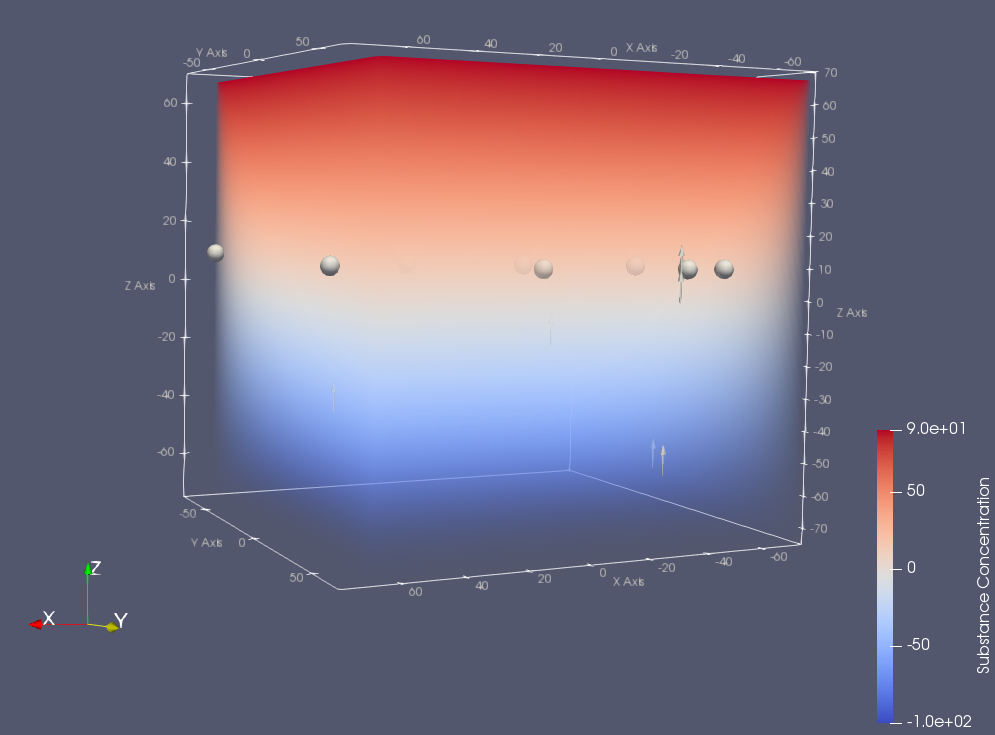

# BioDynaMo
## substance_initializer

Init a substance globally to create a diffusion gradient for cells to move along.

The example shows a substance initializer `LinearConcentration()` that creates a linear concentration along one axis given two points of the line i.e. (startpos_, startvalue_) and (endpos_, endvalue_)
The linear concentration results in a constant gradient along the axis. 



## Version
```
BioDynaMo v0.1.0-135-g39a8687
```
